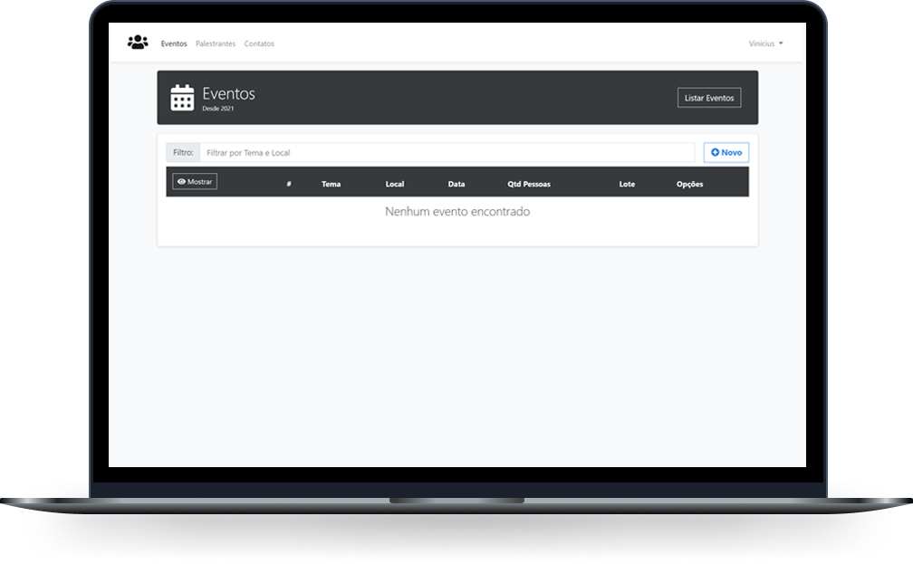

<h1 align="center">
  
</h1>

  <a href="#-tecnologias">Tecnologias</a>&nbsp;&nbsp;&nbsp;|&nbsp;&nbsp;&nbsp;
  <a href="#-projeto">Projeto</a>&nbsp;&nbsp;&nbsp;

 

  

## 🚀 Tecnologias

Esse projeto foi desenvolvido com as seguintes tecnologias:

- .NET Core
- Entity Framework Core
- Angular
- SQLite

## 💻 Projeto

O ProEventos é uma aplicação WEB destinada á partilha de eventos.

## Como utilizar

Run `dotnet run` in 'Back/src/ProEventos.API' to execute the API.

Run `ng serve -o` in 'Front/ProEventos-App' to execute the Angular.

## Curso

https://www.udemy.com/course/angular-dotnetcore-efcore/

---

Feito com ♥ by Pedro Santana
